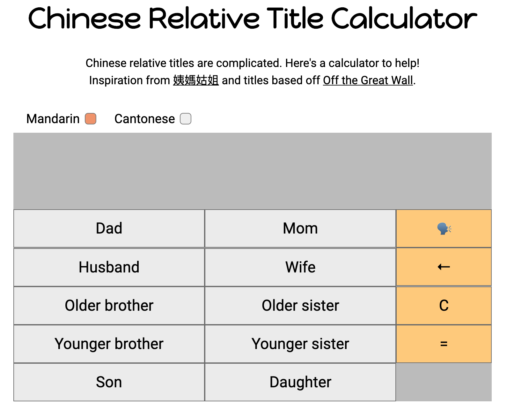
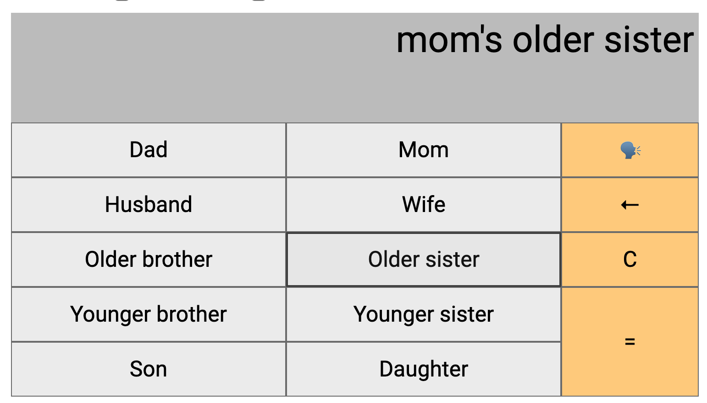
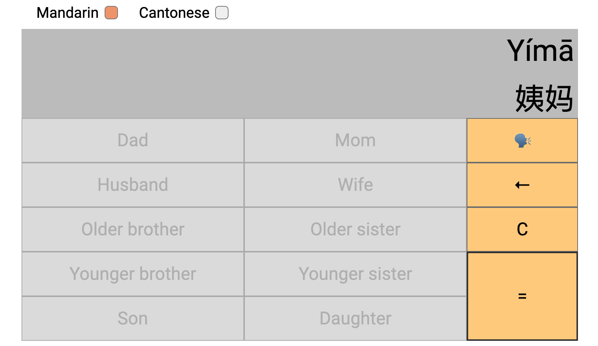

# Asian Relative Title Calculator

A React web application to calculate how to address relatives in Asian languages.

Inspired by the existing android application [姨媽姑姐](https://play.google.com/store/apps/details?id=org.igears.relativesa&hl=en)
but expanded to include more translations and audio output meant for english users. Family titles are taken from the video by [Off the Great Wall](https://youtu.be/nCFRoILS1jY) and these articles from [The Talking Cupboard](https://thetalkingcupboard.com/2013/05/11/korean-family-and-kinship-terms/) and [Learn Japanese Adventure](https://www.learn-japanese-adventure.com/japanese-family.html).

The basic skeleton of the application taken from [Nitin Patel's React calculator tutorial](https://github.com/niinpatel/calculator-react). Speech synthesis made with [npm speak-tts](https://www.npmjs.com/package/speak-tts).




## To run:

```
    npm install && npm start
```  

## To use:

Click on the grey buttons according to the relation you want to know about. For example, to find your mom's older sister's title, simply click `Mom`, `Older sister`, `=` to find the result.



Feel free to click 🗣 to hear the audio, or toggle between the Mandarin, Cantonese, Korean, and Japanese languages to learn the differences between them!


